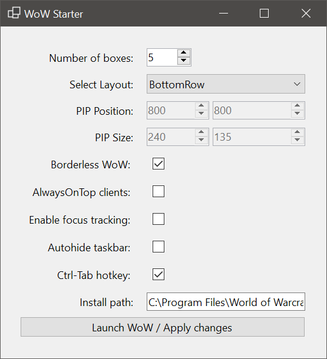

# WoW Starter

A simple utility to launch multiple World of Warcraft instances and position them on your desktop in different layouts, including the ability to set the windows to borderless and alwaysOnTop, and a hotkey to switch which window is being shown as the big "maximized" main window.

This software does NOT send or allow to to send any input to World of Warcraft! It should be fully compliant with the new rules for WoW.

The software is supplied "as is" under MIT license, no liability, see license file for details.

You can download it [from the releases here](https://github.com/DejayRezme/WoWStarter/releases).

## Features

* Number of boxes: allows you to set up many wow windows can be started. Currently restricted to 10
* Select Layout: Best to try them out. The screen is subdivided into 3x3 or 4x4 grid and the main window is being put in the top left portion of the grid while the smaller windows are arranged either on the bottom (BottomRow) or at the bottom then going up (BottomRowAndRight).
* Install path: Set the install path to your "\_retail\_" directory containing the wow.exe first. I haven't tested if it works for classic, let me know.
* Launch WoW / Apply Changes: This launches the wow instances or updates their window position if you changed the layout or pip position or borderless / always on top state. So you can press this button repeatedly, it will launch / update previously launched wow windows as needed
* Borderless WoW: Removes the caption and border from the wow window for less clutter. 
* AlwaysOnTop clients: Makes only the smaller windows or PIP windows always on top.
* Enable focus tracking: This enables the windows build in x-mouse focus tracking. Other utilities can do this too. Sets mouse focus tracking with no delay and no raising of windows. Applied immediately.
* Enable hide taskbar: This sets the windows taskbar to autohide. This is useful if you don't want the taskbar to be above your smaller wow windows. Applied immediately (but not on start)
* Ctrl-Tab hotkey: This enables a hotkey that will allow you to click on one of the smaller wow windows and switch it to the bigger window. Useful for configuring alts. Together with mouse over focus tracking you can hover over a small pip and press Ctrl+Tab to maximize, and press it again to switch back. If you press it when the maximized window is in focus then it will cycle through all wow windows
* The utility saves a config file called WoWStarter.json next to the exe, so make sure to have write permission

---

MIT License

Copyright (c) 2020 Dejay Rezme

Permission is hereby granted, free of charge, to any person obtaining a copy
of this software and associated documentation files (the "Software"), to deal
in the Software without restriction, including without limitation the rights
to use, copy, modify, merge, publish, distribute, sublicense, and/or sell
copies of the Software, and to permit persons to whom the Software is
furnished to do so, subject to the following conditions:

The above copyright notice and this permission notice shall be included in all
copies or substantial portions of the Software.

THE SOFTWARE IS PROVIDED "AS IS", WITHOUT WARRANTY OF ANY KIND, EXPRESS OR
IMPLIED, INCLUDING BUT NOT LIMITED TO THE WARRANTIES OF MERCHANTABILITY,
FITNESS FOR A PARTICULAR PURPOSE AND NONINFRINGEMENT. IN NO EVENT SHALL THE
AUTHORS OR COPYRIGHT HOLDERS BE LIABLE FOR ANY CLAIM, DAMAGES OR OTHER
LIABILITY, WHETHER IN AN ACTION OF CONTRACT, TORT OR OTHERWISE, ARISING FROM,
OUT OF OR IN CONNECTION WITH THE SOFTWARE OR THE USE OR OTHER DEALINGS IN THE
SOFTWARE.